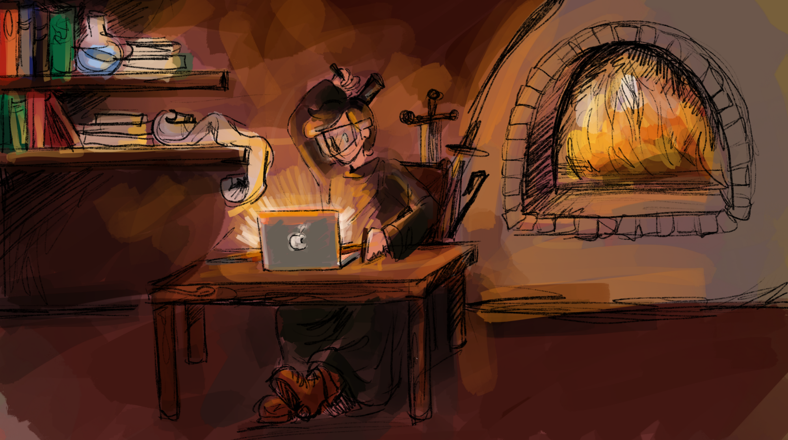

import PostNote from "atoms/PostNote/PostNote"
import Link from "atoms/Link/Link"

_Em meio a esta volátil indústria a obra de Robert C. Martin continua sendo um chamado bastante atual à boa arte dos desenvolvedores de software._

> - Cobro o que me parece justo
> - Cobra pelo material. Não da valor ao teu trabalho.
> - Também cobro pelo trabalho, mas eu não quero demasiado. O trabalho me causa alegria. Oh! Não sabia do melhor, que prazer é trabalhar com a madeira. Cada corte recorda a proximidade do Altíssimo…
> - Tu és um excelente artesão, mas creio que serias um poeta ainda melhor. Alguns trabalham primeiro, depois cantam, depois rezam. Mas, para ti, o trabalho já é canto e oração…¹



Robert (carinhosamente chamado de Uncle Bob) apresenta em sua quinta obra
— [The Clean Coder: A Code of Conduct for Professional Programmers](https://amzn.to/31nZfEI)² —
a sua visão de como um programador deve proceder para ser tratado como um profissional: 
como ser responsável pelo seu trabalho e pelo seu desenvolvimento; 
como ser levado a sério e dizer não quando essa é a resposta a ser dada; 
como fazer que confiem em suas decisões e dêem valor ao que você produz;
como dominar a técnica e ensiná-la.

O livro mostra que o desenvolvedor de software deve buscar ser como um grande artesão — como Fronte Estrelada³, personagem de J.R.R. Tolkien ou São José, pai adotivo de Nosso Senhor — que trabalha rapidamente mas sem se apressar — ou seja, é ágil e assertivo.
Que dá boas e claras estimativas para a resolução de seu trabalho — sincero e transparente.
Cumpre seus compromissos — confiável — e tem um grande respeito pela sua arte — enamorado pelo que faz.
Uma arte que é ensinada pelos mais velhos e experientes, reaprendida ao observar os mais jovens e espalhada simplesmente por sua beleza.

Assim como em seu quarto livro, [Clean Code: A Handbook of Agile Software Craftsmanship](https://amzn.to/33GmLOA), Bob reuniu problemas de como bem escrever software que aprendeu em sua carreira.
Em Clean Coder ele nos leva a uma viagem de como ele mesmo amadureceu durante a sua carreira, e como esta vontade de ser considerado um profissional ocorreu a ele.
Robert apresenta algumas situações que causam incômodo, como o diálogo de Mike e Paula onde Mike simplesmente ignora todas as vezes que Paula diz que não será possível entregar novas funções que não tinham sido combinadas:

> - Você disse que o faria funcionar para mim.
> - Não, Mike, eu não disse. Eu disse que era impossível. Aqui está uma cópia do memorando que enviei após nossa conversa.
> - Sim mas você ia tentar mesmo assim, certo?
> - Já discutimos isso. (…)

Ou o diálogo de Peter e Marge onde Marge realmente precisava do módulo de avaliação pronto para segunda feira e Peter encontra uma maneira de se comprometer:

> - Peter, realmente preciso de uma definição nisso aqui. Existe alguma maneira de você se comprometer a entregar isso até segunda-feira de manhã?
> - Não Marge, não tenho como dar certeza de qualquer data que não seja terça-feira. Sinto muito se isso bagunça seu planejamento, mas trata-se apenas da realidade de que estamos encarando
> - Peter, olha, sei que isso é uma imposição enorme, mas realmente preciso que você encontre uma forma de fazer isso até segunda-feira de manhã. É realmente crítico. Não há nada que possa fazer de verdade?
> - Ok, Marge, vou dizer o seguinte. Vou ligar para casa e dizer para minha família que terei que abrir mão de um pouco de tempo com eles. Se para eles estiver tudo bem, então conseguirei que esta tarefa esteja pronta até segunda-feira de manhã. Inclusive, virei na segunda-feira para ver se tudo vai correr bem com Willy. Mas então vou para casa e só voltarei na quarta-feira. Fechado?

Nos enroscamos nessas situações em nosso dia-a-dia e, se realmente queremos ser profissionais, temos de ser firmes. Manter nossa posição se ela é a certa. Dar as más noticias rápido. Nos comprometer com os prazos dados.

Mas mesmo frente a essas grandes lições de habilidades interpessoais que, ao lermos no livro podem parecem óbvias à primeira vista — mas são como um trovão que nos acorda — a que mais me pegou desprevenido é a de que devemos nos manter firmes às práticas aprendidas, principalmente nos momentos de crise.
Se [Desenvolvimento Guiado a Testes (TDD)](https://en.wikipedia.org/wiki/Test-driven_development) é importante para que o código fique mais limpo e correto, em momentos de crise temos que usá-lo mais ainda para nos ampararmos a esta segurança.
Se [desenvolvimento em dupla](https://en.wikipedia.org/wiki/Pair_programming) nos ajuda a manter o foco, porque não o fazer nos momentos mais difíceis?
Se manter um código limpo com bons nomes de variáveis, injeção de dependência, e uma [arquitetura hexagonal](https://en.wikipedia.org/wiki/Hexagonal_architecture_(software)) bem definida nos dá mais agilidade, qual o motivo para deixar as boas práticas quando estamos em apuros? 
Tudo isso deve ser seguido no dia-a-dia e principalmente nos momentos de crise.

O The Clean Coder foi escrito há 8 anos e, por ser um livro focado no comportamental do desenvolvedor de software que deseja se tornar um artesão, continua bastante atual.
Certamente é um livro que, se você for um amante desta arte com alguma experiência, deve apresentar para seus aprendizes e, se você é um aprendiz, deve lê-lo.

> (…) Quando tinha tempo, ele fazia objetos por deleite. 
> E eram belos, pois sabia trabalhar o ferro em formas maravilhosas, que pareciam tão leves e delicadas como uma ramagem de folhas e flores, mas retinha a inflexível resistência do ferro ou pareciam mais fortes ainda.
> Eram poucos os que passavam por um dos portões ou gradis que ele fazia sem parar para adimirá-lo.
> Ninguém conseguia atravessá-lo depois de fechado.
> Ferreiro cantava quando estava fazendo objetos desse tipo, e quando começava a cantar, os que estavam em torno interrompiam o trabalho e iam até a forja para escutar.³

```
1. A Sombra do Pai: História de José de Nazaré / Jan Dobraczyński — São Paulo: Cultor de Livros, 2017;
2. O Codificador Limpo: Um Código de Conduta para Programadores Profissionais / Robert C. Martin — Rio de Janeiro: Alta Books, 2012;
3. Ferreiro de Bosque Grande / J.R.R. Tolkien — São Paulo: Editora WMF Martins Fontes, 2015.
```
