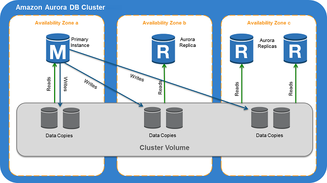
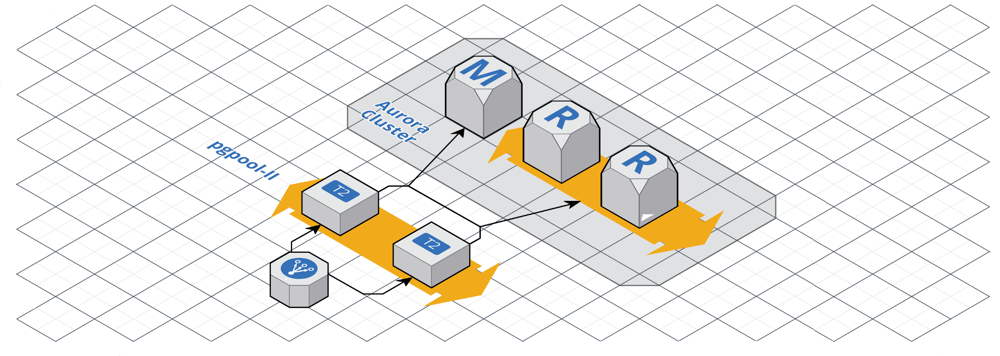

import PostNote from 'atoms/PostNote/PostNote'
import Link from 'atoms/Link/Link'

Um problema bom que empresas de tecnologia em rápido crescimento podem ter é o de que a utilização da CPU do banco de dados está atingindo níveis muito altos, e precisa ser trocada toda semana. Essa é a história de como nós do Zé Delivery, depois de ver uma apresentação da MaxiMilhas (obrigado, pessoal!) no AWS Summit 2018 em São Paulo, substituímos nossa instância única — sozinha, coitada, lá no console do RDS — de PostgreSQL por um cluster de Amazon Aurora atrás de um load balancer com instâncias de pgpool-II.

Primeiro só gostaria de levantar algumas informações sobre o nosso negócio e sobre a situação que estávamos enfrentando para que as nossas decisões de arquitetura fiquem mais claras.

- Nosso negócio se parece bastante com um marketplace, então as chamadas recebidas pela nossa API apresentam um viés para as leituras, e não para as escritas. Essa solução provavelmente não vai funcionar (ou vai ser de nenhuma utilidade) caso a distribuição das suas chamadas tenha um viés para a escrita;
- Nossa API é [serverless](https://aws.amazon.com/serverless/) usando o AWS Lambda e tem picos de mais de 500 execuções concorrentes;
- Nós precisamos da extensão de sistema de informação geográfica do PostgreSQL;
- Aurora Serverless para PostgreSQL tinha acabado de ser lançado na época;

Agora explicarei de uma forma resumida as principais características do Amazon Aurora e do pgpool-II para resolver problemas de escala — junto com as recomendações da AWS — que justificam nossas decisões de projeto.
Depois, então, vou descrever nossa stack elástica levantando algumas coisas que aprendemos desde que colocamos ela em produção.

## Amazon Aurora
Um cluster Amazon Aurora é um banco de dados relacional compatível com PostgreSQL que consiste em um grupo de uma a dezesseis instâncias ligado a um sistema de armazenamento distribuído — tolerante a falhas e com recuperação automática — que se estende por várias zonas de disponibilidade com uma cópia dos dados em cada.

A característica que vamos nos ater — sem desmerecer todas as outras de disponibilidade e resiliência — é a sincronização das réplicas de leitura e a sua fácil criação.

## Aurora Read Replicas
Aurora Replicas são endpoints de leitura independentes em um cluster de Amazon Aurora que a AWS balanceia a carga convenientemente em um endpoint único de leitura. Você pode ter até 15 replicas distribuídas entre as zonas de disponibilidade do cluster. O atraso entre a escrita e a disponibilidade nas réplicas de leitura é da escala de milissegundos — menos de 100ms no nosso caso.

<PostNote isBlue>
    

        Aurora Replicas funcionam bem para escalar buscas em banco de dados porque elas são totalmente dedicadas para operações de leitura no seu cluster de armazenamento. O Banco de dados principal gerencia as operações de escrita. O cluster de armazenamento é compartilhado entre todas as instâncias em seu cluster de banco de dados. Portanto, nenhum trabalho adicional é necessário para replicar uma copia dos dados para cada Aurora Replica. Em contraste, cada réplica de leitura do PostgreSQL precisa aplicar, em uma única thread, todas as operações de escritas da instancia principal do banco de dados em seu armazenamento local. Essa limitação pode afetar a capacidade de uma réplica de leitura PostgreSQL de suportar grandes volumes de tráfegos de escrita.
    

    <Link
        className="PostNote__link"
        to="https://developer.mozilla.org/en-US/docs/Web/HTML">
        User Guide for Aurora
    </Link>
</PostNote>

Alem disso tudo, você pode criar um auto-scalling group que controla o numero de instâncias de Aurora Replicas no seu grupo de leitura baseado em utilização de CPU ou número de conexões. Com isso a sua capacidade de leitura de dados pode crescer até a — colossal escala de — 720 núcleos de um processador Intel Xeon Platinum de 2,5 GHz, 5.376 GiB de memória RAM, 350 Gbps de performance de rede.

## Recomendações da AWS sobre aumentar a capacidade de bancos de dados
Já tivemos que escalar verticalmente nossa instância de banco de dados duas vezes.
O banco de dados ficou cinco minutos sem responder — e isso é bastante tempo.
Ficamos ansiosos, com medo de alguma coisa dar errado e precisarmos restaurar os dados de algum backup.
Por isso não gostamos de escalar o banco verticalmente.
Por mais que tenhamos nos saído bem das duas experiências, não é algo que queremos ter que fazer todas as quartas, quintas e sextas-feiras, alem dos finais de semana.
Por isso que optamos por uma estratégia de escala horizontal, onde podemos aumentar a capacidade do cluster de bancos de dados sem ficar um segundo desconectado.

O [AWS Database Blog](https://aws.amazon.com/blogs/database/) é um bom lugar para responder perguntas sobre bancos de dados, mesmo não usando soluções de infraestrutura da Amazon.
Foi lá que fomos buscar responder nossas perguntas após assistir a palestra de como a MaxiMilhas resolveu seu problema de escala de banco de dados.

### Escalando Horizontalmente
No artigo ["Scaling Your Amazon RDS Instance Vertically and Horizontally"](https://aws.amazon.com/blogs/database/scaling-your-amazon-rds-instance-vertically-and-horizontally/) confirmamos a idéia de usar o Amazon Aurora.
A Amazon é bem clara quanto a maneira de escalar horizontalmente: <b>use réplicas de leitura e divida suas consultas entre as de escrita e as de leitura.</b>
As opções para dividir as consultas entre escrita e leitura são duas: usar algum módulo na sua camada de persistência para fazer a divisão ou instalar um balanceador de carga L7.

### Dividir as consultas na sua camada de persistência
Dividir as consultas na camada de persistência resultaria em cada execução de AWS Lambda abrir duas conexões com o banco de dados. Isso não é ideal mas seria um preço a se pagar para solucionar o problema de forma rápida sem colocar novas peças moveis na infraestrutura. O maior problema dessa solução seria, no nosso caso, não ter uma única transação e sim duas, uma para a escrita e uma para a leitura. Isso seria uma dívida técnica grande demais, então resolvemos analisar a segunda opção.

### Balanceador de carga L7
Um balanceador de carga L7 ou <i>layer 7</i> opera na sétima camada do modelo [OSI](https://pt.wikipedia.org/wiki/Modelo_OSI#7_-_Camada_de_Aplicação), a camada de aplicação.
É uma peça de infraestrutura que divide as requisições a um determinado IP baseado em seu conteúdo — no nosso caso no conteúdo da consulta SQL.
O balanceador de carga L7 pode enviar todas as consultas iniciadas por `SELECT` para um determinado IP e as iniciadas por `UPDATE`, `CREATE` e `DELETE` para outro.

Isso nos ajudou a responder quase todas as dúvidas que tivemos ao voltar do <i>AWS Summit</i>.
Precisávamos escalar nossa camada de persistência horizontalmente usando um balanceador de carga L7.
Só nos restou uma dúvida, pois todos os exemplos e softwares apresentados no AWS Summit e no AWS Database Blog eram para MySQL: Não usamos MySQL, será que existe algo como o ProxySQL e o MySQL Proxy para PostgreSQL?

## pgpool-II
O [pgpool-II](https://github.com/pgpool/pgpool2) é um middleware que funciona entre instâncias de PostgreSQL e seus clientes.
Ele é um software bastante completo para a manutenção de clusters de PostgreSQL com alta disponibilidade, mas, como o Amazon Aurora já implementa várias de suas funções nativamente, vamos nos ater no enfileiramento (queuing), represamento (pooling) de conexões e no balanceamento de requisições.

### Enfileiramento de Conexões
Existe um limite do número de conexões que podem ser feitas a um banco de dados simultaneamente e sua performance tem alta correlação com este número — para entender melhor recomendo [ler o que Brett Wooldridge escreveu sobre o assunto](https://github.com/brettwooldridge/HikariCP/wiki/About-Pool-Sizing).
Para melhorar a performance da camada de persistência o pgpool-II mantêm o número de conexões em um valor máximo, todas as conexões subsequentes devem esperar numa fila para conectar com o banco de dados.

### Represamento de Conexões
O pgpool-II salva as conexões com as instâncias de PostgreSQL (servidores) e as reusa toda vez que uma nova conexão com as mesmas propriedades (como senha, banco de dados) é feita.
Com isso ela reduz o tempo de fazer essa nova conexão e aumenta a capacidade de tráfego de informações do cluster.

### Balanceamento de Requisições
Se os dados do banco de dados estão replicados, executar consulta de leitura (`SELECT`) em qualquer uma das instâncias, tanto a principal como as replicas, terá o mesmo resultado.
Por causa disso o pgpool-II usa as instâncias de replicação para distribuir as consultas de leitura entre várias instâncias de replicação, aumentando — novamente — a capacidade de tráfego de informações do cluster.

Juntando a facilidade de gerenciamento do Amazon Aurora e o balanceamento de requisições do pgpool-II pudemos então montar nossa camada de persistência elástica.

## A Camada de Persistência Elástica do Zé Delivery

A estrutura que está hoje em produção é a ilustrada acima. 
Consiste em um balanceador de carga L4 (<i>Network Load Balancer</i>) distribuindo as requisições em um grupo de Auto Scaling com as instâncias de pgpool-II.
Estas se conectam aos endpoints padrões de escrita e leitura do cluster Amazon Aurora.
Configuramos o cluster para adicionar novas réplicas quando a CPU média das instâncias de leitura passa de 50% — subir uma instância a mais sem necessidade não é algo caro, desde que elas sejam destruídas assim que necessário — e o Auto Scaling dos pgpool-II é baseado no tráfego de rede médio do grupo.

Um bom lugar para começar a construir isso é [clonando este repositório de exemplo da AWS](https://github.com/aws-samples/amazon-aurora-pgpool-example) e não esquecer de seguir as [recomendações na documentação do pgpool-II para o uso com Amazon Aurora](https://www.pgpool.net/docs/latest/en/html/example-aurora.html).
O nosso processo de amadurecimento levou cerca de dois meses e creio que essas sejam as coisas mais importantes que aprendemos:

- A utilização de CPU das instâncias do pgpool-II tem pouco significado, o recurso mais crítico para elas é o tráfego de rede. Por isso que optamos por instâncias do tipo <b>m5</b>. Esta apresenta uma performance de rede melhor que as <b>t3</b>;
- Não enviar consultas de leitura para a instância primária do cluster. Ela já vai ter trabalho o suficiente com as escritas. Alem disso, ela não consegue escalar horizontalmente, então, colocar a carga extra fará necessário escalar verticalmente mais cedo;
- Criar uma imagem de disco (AMI) ao invés de baixar e instalar todos os binários nas instâncias de pgpool-II todas as vezes que são criadas. Nós não fizemos isso e um dia o http://pgpool.net/ parou de responder. Com isso todas as nossas novas instâncias criadas (e várias foram criadas pois o balanceador de carga não parava de pedir mais) não funcionavam;
- Não usar custom-endpoints do Amazon Aurora. Eles levam muito tempo para ficarem disponíveis depois de qualquer alteração e o pgpool-II vai desistir de conectar com o cluster antes do endpoint ficar disponível;
- Enviar os logs do pgpool-II para um agregador de logs — no caso do CloudWatch basta instalar o awslogs (`yum -y install awslogs`) e configurar a rotação de logs para que o disco das instâncias não fique cheio;
- Criar um <i>cron script</i> para reiniciar as instâncias de pgpool-II que se desconectarem do cluster.

Essa estrutura funciona de maneira estável em produção sem nenhuma alteração desde setembro de 2019. Ela já suportou os picos de acesso durante as férias de verão e carnaval sem precisarmos atuar na infraestrutura de persistência durante os eventos. Estamos bastante satisfeitos com o que ela já fez para o Zé Delivery. 🍻

Espero ter ajudado, caso tenha alguma dúvida não deixe de entrar em contato escrevendo um comentário aqui no Medium ou pelo meu twitter: [@flpStrri](https://twitter.com/flpStrri).
